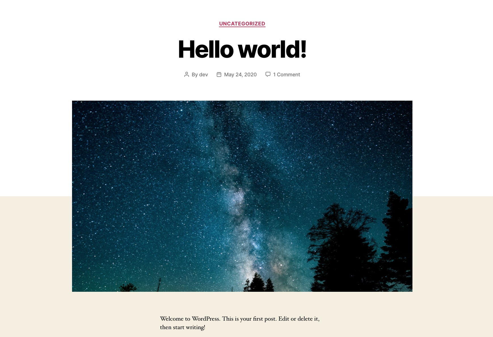

# Easy Stock Featured Image
[](https://wordpress.org/plugins/easy-stock-featured-image/)
[](LICENSE)
[](https://github.com/dcangulo/easy-stock-featured-image/pulls)
[](https://wordpress.org/support/plugin/easy-stock-featured-image/reviews/#new-post)

Automatically attach stock photos as featured image to your posts without featured image.

Stock photos are provided by **[Unsplash](https://unsplash.com/)**.

## How does it work?
Checks if the post (any post type with thumbnail support, including pages) has already a featured image associated, if it doesn't have one, it will fetch a stock photo from Unsplash and upload it to your media library then attach it as featured image.

## Installation
1. In your WordPress admin menu, hover to **Plugins** and click **Add New**.
2. Enter **Easy Stock Featured Image** in the searchbox.
3. Find the plugin entitled **Easy Stock Featured Image** by **David Angulo** then click **Install Now**.
4. Click **Activate** once the plugin is installed.

## Installation using Composer
```
composer require wpackagist-plugin/easy-stock-featured-image
```

## Screenshots

1. [Easy Stock Featured Image running on Twenty Twenty theme](assets/screenshot-1.jpg).
2. [Easy Stock Featured Image settings and preferences](assets/screenshot-2.jpg).

## License
Copyright © 2022 David Angulo, released under the GPL2 license, see [LICENSE](LICENSE).
